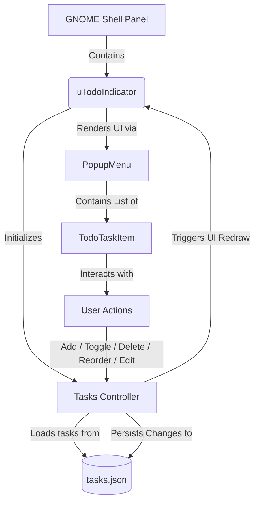

# Agent Guide: uTodo GNOME Shell Extension

Welcome, AI Agent! This document serves as your comprehensive onboarding and architectural guide to working on **uTodo**, a simple and beautiful todo list manager right in the GNOME top bar.

---

## 📌 Project Overview
uTodo is a custom GNOME Shell extension designed to help users manage their task lists dynamically, right from their panel.
- **UUID:** `utodo@abhay.projects`
- **Supported GNOME Versions:** GNOME 45, GNOME 46+ (utilizing the modern ESM import standard).
- **Core Technology Stack:** JavaScript (ESM, GObject), GNOME Clutter/St (Shell Toolkit), GLib/Gio (system APIs), and Vanilla CSS (GNOME Shell Theme stylesheets).

---

## 📂 Codebase Map

| File | Purpose | Key Details |
| :--- | :--- | :--- |
| [`metadata.json`](file:///home/abhay/projects/SIDE-PROJECTS/utodo/metadata.json) | Extension manifest. | Declares UUID, name, description, and shell-version compatibility. |
| [`extension.js`](file:///home/abhay/projects/SIDE-PROJECTS/utodo/extension.js) | Core extension logic and UI classes. | Main entrypoint containing custom widgets (`TodoTaskItem`, `uTodoIndicator`) and GObject-subclassed components. |
| [`stylesheet.css`](file:///home/abhay/projects/SIDE-PROJECTS/utodo/stylesheet.css) | GTK/GNOME Shell styling. | Defines active, completed, hover, and transition styles for uTodo UI elements. |
| [`install.sh`](file:///home/abhay/projects/SIDE-PROJECTS/utodo/install.sh) | Installation automation. | Helper script to copy extension resources into GNOME's local extensions folder and print instructions. |

---

## ⚙️ Architectural Workflow & Data Flow



### 1. GNOME Shell Integration (ESM)
Starting from GNOME 45, GNOME Shell requires the modern **ES Modules (ESM)** system instead of standard CommonJS/CJS syntax.
- **Do not use `const Me = imports.misc.extensionUtils.getCurrentExtension();`**
- **Do use:**
  ```javascript
  import { Extension } from 'resource:///org/gnome/shell/extensions/extension.js';
  import * as Main from 'resource:///org/gnome/shell/ui/main.js';
  import * as PanelMenu from 'resource:///org/gnome/shell/ui/panelMenu.js';
  import * as PopupMenu from 'resource:///org/gnome/shell/ui/popupMenu.js';
  ```
- Internal Shell bindings are loaded via the `gi://` scheme:
  ```javascript
  import St from 'gi://St';
  import Clutter from 'gi://Clutter';
  import Gio from 'gi://Gio';
  import GLib from 'gi://GLib';
  import GObject from 'gi://GObject';
  ```

### 2. GObject Subclassing
Custom widgets are registered using `GObject.registerClass` to play nicely with the GNOME Shell runtime:
- **`TodoTaskItem`**: Subclasses `PopupMenu.PopupBaseMenuItem`. Represents a task with interactive check-boxes, drag-and-drop / ordering triggers, editing entries, and delete action.
- **`uTodoIndicator`**: Subclasses `PanelMenu.Button`. The top bar container containing the status badge and dropdown list.

### 3. Persistent Data Storage
Tasks are serialized into JSON format and written using the `Gio.File` APIs.
- **Location:** `$HOME/.config/utodo/tasks.json` (specifically resolved via `GLib.get_user_config_dir() + '/utodo/tasks.json'`).
- **Data Model:**
  ```typescript
  interface Task {
      id: number;       // Date.now() timestamp
      text: string;     // Task title/description
      completed: boolean; // Completed state
  }
  ```

---

## 🛠️ Development & Debugging Workflow

Use the following commands to install, test, and view runtime outputs.

### 1. Installation
Deploy changes to the local GNOME extensions directory:
```bash
./install.sh
```
This moves files to `~/.local/share/gnome-shell/extensions/utodo@abhay.projects`.

### 2. Enabling/Disabling the Extension
```bash
# Enable
gnome-extensions enable utodo@abhay.projects

# Disable
gnome-extensions disable utodo@abhay.projects

# View status
gnome-extensions info utodo@abhay.projects
```

### 3. Reloading GNOME Shell
GNOME Shell does not automatically reload custom extensions when source files change. You must force a reload:
- **On X11 Session**: Press `Alt+F2`, type `r`, and press `Enter`.
- **On Wayland Session**: Due to Wayland security designs, you must **Log Out and Log In** again, or restart your desktop session.

### 4. Viewing Logs & Debug Output
Use `journalctl` to tail live error logs or console statements:
```bash
journalctl /usr/bin/gnome-shell -f -o cat
```
Or for user session systemd services:
```bash
journalctl --user -f -o cat -u gnome-shell
```

---

## 🎨 Styling & Design Aesthetics

All styling properties in `stylesheet.css` should follow GNOME Shell's Adwaita/Material design guidelines:
- **Primary Color (Active items, toggles):** Adwaita Blue `#3584e4` (`rgba(53, 132, 228, 0.18)` for transparency).
- **Warning/Delete Color:** Red `#ef476f` / `#e01b24`.
- **Interactive Toggles:** Give interactive icons subtle opacity changes (e.g., standard opacity `0.4` rising to `1.0` on hover) to feel alive.
- **Fonts & Padding:** Rely on system typographic scaling and standard relative padding (`px` or `em`).

---

## ⚠️ Important Agent Guidelines

When modifying this codebase, always adhere to the following rules:

1. **Preserve Compatibility:** Do not introduce syntax/libraries incompatible with GNOME Shell's internal GJS (Gjs JavaScript Engine). Use only vanilla modern JS (ES2022+ features supported by GJS).
2. **Handle Main Loop Gracefully:** When using timers, always return `GLib.SOURCE_REMOVE` in timeout callbacks unless you specifically intend the timeout to run recursively (in which case, return `GLib.SOURCE_CONTINUE`). Failing to do this causes memory leaks.
3. **Synchronize Stylesheet & JS:** If you add a new widget class to `extension.js`, you must define its styles in `stylesheet.css`. Avoid hardcoding style rules directly in JS using `set_style()` unless absolutely necessary.
4. **Never Block the Main UI Thread:** GNOME Shell runs on a single main thread. Any blocking operations (like reading massive files or synchronous network requests) will freeze the entire shell interface. Always use non-blocking asynchronous APIs (e.g. `load_contents` / `replace_contents` asynchronously if files are expected to grow large, though for tiny JSON files, standard APIs are typically fast enough).
5. **Preserve Extension Lifecycle:** Ensure everything created in `enable()` is completely torn down in `disable()`. Failure to do so will cause the extension to crash or leave ghost widgets on the panel when disabled/uninstalled.
